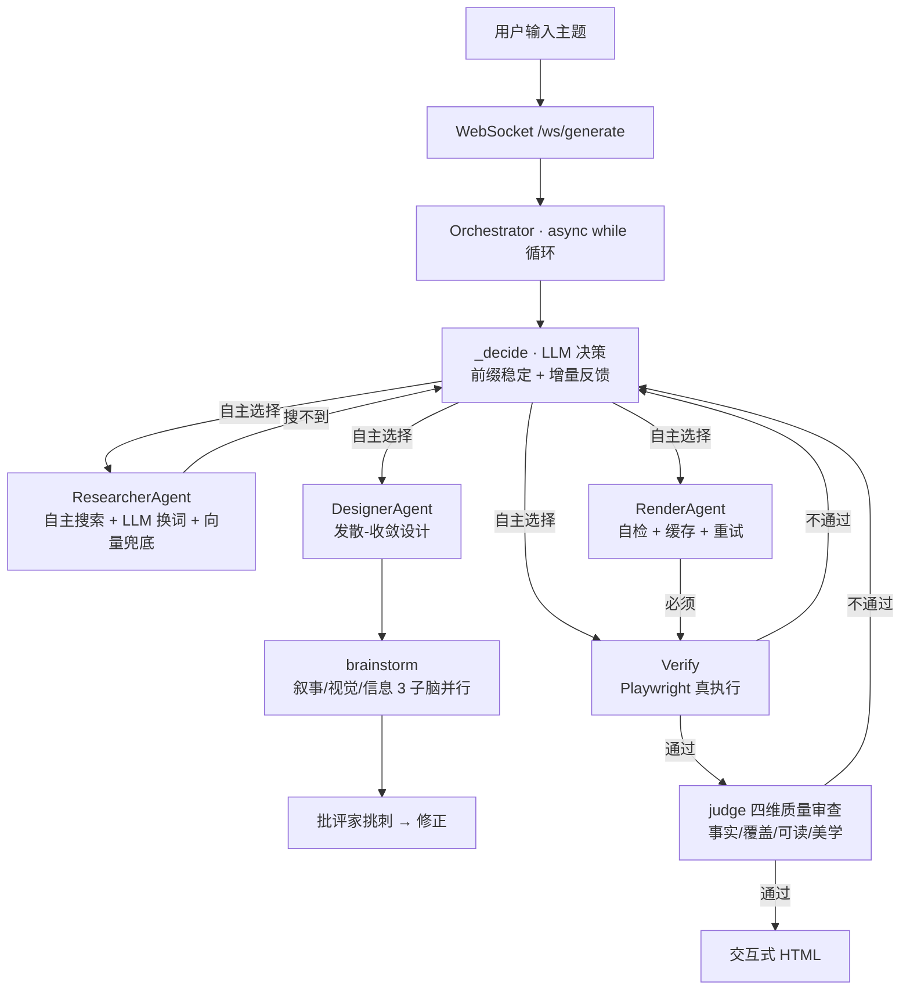

# Lumen · 给 LLM 装可插拔 skill 的 AI 原生工作台

> 你选 skill（风格 + 工具）、定模式（网页 / 游戏），LLM 自己决定流程把它做出来——全程透明、可迭代。
> 不是"调了 LLM 的流水线"，是 **流程由 LLM 自己决定、能力由 skill 可插拔** 的 AI 原生系统。

[](LICENSE)


---

## 它是什么

三个关键词：

1. **AI 原生编排** —— 流程不被人写死。LLM 自己决定：搜几次、跳过搜索直接用知识、审查不过退给谁。
2. **可插拔 skill** —— 能力不被人写死。风格（杂志 / 信息图 / 像素）与工具都是可选的 skill，你给 LLM 装什么手艺，它就会什么手艺。
3. **全程透明** —— 每一步决策、每次工具调用、每分钱成本，实时可见、落盘可回放。

---

## 为什么是 AI-Native？

流程不是人写死的。LLM 自己决定：搜几次？跳过搜索直接用自身知识？审查不过退给谁？

| 传统 Pipeline | 本系统 |
|-------------|--------|
| 人决定"先搜→再设计→再写→再审查" | LLM 自主决策每一步调什么工具 |
| 审查不通过→固定退回上一步 | LLM 诊断病因→退回正确的节点 |
| 素材不足→硬着头皮生成→失败 | LLM 主动触发"诚实模式"降级 |
| 搜索死循环→耗尽预算 | 搜索 8 次硬拦截 + LLM 自身知识兜底 |
| 生成的代码对不对→LLM 自己猜 | Playwright 无头浏览器真执行验证 |
| 设计闷头出一个方案 | **发散-收敛**：3 个创意子脑并行出方案 → 大脑综合 → 批评家挑刺 |

---

## 架构



**硬边界**（LLM 不能突破）：最多 20 步 · 预算 ¥1 · 搜索 ≤8 次 · render 后必须 verify · 连续 2 次 verify 失败强制终止。

---

## 端到端评测（真实数字）

`cd backend && python scripts/eval_run.py` 跑出来的真实结果（DeepSeek 真实调用）：

| 指标 | 值 |
|------|-----|
| 通过率 | **100%**（10 个不同话题，全部一次通过）|
| 平均步数 | **4.7 步** |
| 每任务真实成本 | **约 ¥0.02**（DeepSeek v4-flash 真实费率，含缓存拆分）|
| 验证方式 | 端到端评测 + Playwright 外部验证 + 决策轨迹可回放 |

> 每个任务的决策轨迹（thought/工具/成本）都落盘可回放——`backend/logs/traces/`。

---

## 快速开始

**前置要求**：Python 3.11+ · Node.js 18+ · DeepSeek API Key · Tavily Key（可选）

```bash
git clone https://github.com/hfujw/ai-native-workflow.git
cd ai-native-workflow

# 1. 配 Key
cp backend/.env.example backend/.env
# 编辑 backend/.env：DEEPSEEK_API_KEY=sk-xxxxxxxx

# 2. 后端
cd backend
python -m venv venv
venv\Scripts\pip install -r requirements.txt      # Windows
# python3 -m venv venv && source venv/bin/pip install -r requirements.txt  # macOS/Linux
venv\Scripts\python -m uvicorn app.main:app --port 8001

# 3. 前端（Tauri 桌面应用，新终端）
cd desktop
npm install
npm run tauri dev
```

会自动弹出桌面窗口。

### 首次启动说明

- ChromaDB 中文模型（~400MB）首次自动从 `hf-mirror.com` 下载，国内镜像不需代理
- 下载失败不影响使用——语义检索不可用，关键词 + LLM 自身知识仍然工作
- Tavily Key 不配也没关系——搜索返回空，LLM 用自己的知识
- 不想用后端 .env 的 Key？设置里填自己的 API Key/Base，生成时会话级生效

---

## 项目结构

```
backend/app/
├── main.py                     🚪 FastAPI 装配（日志 + app + 路由挂载）
├── config.py                   ⚙️ 集中配置（pydantic-settings，.env 可覆盖）
├── projects.py                 💾 生成历史持久化（含迭代版本）
├── preferences.py              💾 用户偏好记忆
├── api/                        🌐 路由层
│   ├── generate.py             POST /api/generate + WS /ws/generate（主链路 + 多轮迭代）
│   ├── history.py              生成历史列表 / 回看 / 重命名 / 置顶 / 删除
│   ├── skills.py               skill 列表 / 安装 / 删除
│   ├── preferences.py          用户偏好读写
│   ├── meta.py                 示例话题列表 + 评测报告
│   └── ws.py                   WebSocket 连接管理
│
├── agent/                      🧠 编排脑（LLM 自主决策）
│   ├── orchestrator.py         ⭐ async 主循环 + refine 多轮迭代
│   ├── brainstorm.py           ⭐ 发散-收敛设计（3 创意子脑并行 + 综合 + 批评家）
│   ├── supervisor.py           工具注册表 + 分发
│   ├── message_bus.py          Agent 间消息总线（asyncio.Queue）
│   └── evaluate.py             素材质量评估（非 LLM 判定）
│
├── tools/                      🔧 工具（一能力一文件：原始操作 + Agent 决策包装）
│   ├── search.py               tool_search + ResearcherAgent（LLM 换词 + 向量兜底）
│   ├── design.py               tool_design + tool_compose + DesignerAgent（设计+文案）
│   ├── render.py               tool_render(_stream) + RenderAgent（自检 + 缓存 + 重试）
│   └── verify.py               tool_verify（Playwright 真执行）
│
├── skills/                     🎨 skill 加载器：list/load/install/delete + 模板资产
├── llm/                        🤖 LLM 层
│   ├── client.py               chat / chat_json / chat_stream + 会话级客户端
│   ├── judge.py                ⭐ 四维质量审查 + 设计批评家
│   ├── pricing.py              模型费率表（真实 token 计价）
│   ├── parser.py               strip_fence + safe_parse_json + 注入检测
│   └── circuit_breaker.py      三态断路器
│
├── knowledge/                  📚 知识库
│   ├── kb.py                   169 个示例话题 + 关键词匹配
│   └── vector_store.py         ChromaDB 语义向量检索
│
├── session/                    💾 状态存储（单机内存）
└── observability/              📊 trace / eval_report（决策日志 + 评测）

backend/skills/                  🎨 运行时 skill 目录（首次播种内置，下载/删除都在这；gitignored）
backend/scripts/eval_run.py     📊 端到端评测脚本（跑 N 话题出数字）
backend/tests/                  162 个 pytest 用例

desktop/src/                    🖥️ Tauri 桌面前端（DSH 设计语言）
├── App.tsx                     主布局 + 工具卡片流 + 作品画廊
├── components/                 Composer / ToolCard / SettingsButton / SkillPage / icons
└── hooks/                      useGenerate（WS 客户端）/ usePersistentState / useDropdown / useClickOutside
```

---

## 关键设计决策

| 决策 | 为什么 |
|------|--------|
| 不用 LangGraph | 当前规模用 async while 循环最合适。tool 接口已标准化为 state-in/state-out，预留了迁移能力 |
| 发散-收敛设计（Kimi Swarm 模式） | 创造时多脑：3 个创意子脑（叙事/视觉/信息）并行 → 大脑综合 → 批评家挑刺修正。执行时单脑闭环 |
| 批评家贯穿 | 设计阶段 critique_design 提前挑刺（零成本修正）+ 事后四维审查（事实/覆盖/可读/美学）双保险 |
| RenderAgent 内部自检 | render 是 token 消耗最大的一步——Agent 内部自检循环减少 verify→回退→重 render 的浪费 |
| 验证层外置 | Playwright 真执行，不是 LLM 猜对错。正则硬规则 + 浏览器执行 + 事实核查三阶段 |
| 诚实模式 | 素材不足时 LLM 主动降级为"资料有限"的诚实页面，不编造事实 |
| 搜索是可选增强 | LLM 决策中心——有把握的话题直接跳过搜索，不确定才搜。换词由 LLM 决策，失败回退词表 |
| 向量语义检索 | ChromaDB + text2vec-base-chinese——"嬴政"能搜到"秦始皇"，关键词做不到的 |
| Tavily 替代 Bing | 国内可直连，返回 JSON 已清洗文本。不配 Key 也能跑 |
| 决策严谨性 | _decide 半截 JSON 容错重试一次；决策 prompt 前缀稳定（KV 缓存友好）+ 最近 2 步增量反馈 |
| 断路器 | 连续 3 次 LLM API 失败自动熔断 30s，防止级联故障浪费重试和 Token |
| 预算控制 | 真实 LLM token 成本按模型费率表计入 ¥1 上限，迭代共用同一预算 |
| 知识来源标注 | compose 阶段要求 LLM 给每个数字/年份/人名标注来源和可信度 |
| 结构化输出 | design/compose 用 DeepSeek `json_object` + schema 校验——坏数据不再流向下游 |
| 多轮迭代 | 成品后能继续对话改页面——LLM 决定 rerender/redesign/research，trace 记录每版 |
| 会话级模型与 Key | 前端选模型（deepseek-chat / deepseek-reasoner）+ 自定义 API Key/Base 全程生效（contextvars 隔离） |
| skill 模板资产 | 内置 skill 带真实 template.html 骨架，渲染时注入【参考页面骨架】【参考排版系统】 |
| 记忆与历史 | 偏好自动提取并注入下次生成；每次生成（含迭代）落盘可回看、可续 |
| 决策轨迹 | 每步 thought/工具/成本写 JSONL——可回放、可评测（面试演示素材） |
| 评测基准 | `scripts/eval_run.py` 跑 N 话题，输出通过率/步数/成本——有真实数字 |
| REST API | `POST /api/generate` 程序化生成——是"系统"不是 demo |

---

## 配置项

| 环境变量 | 默认值 | 说明 |
|---------|--------|------|
| `DEEPSEEK_API_KEY` | **必填** | DeepSeek API Key |
| `DEEPSEEK_BASE_URL` | https://api.deepseek.com | API Base（可换兼容网关） |
| `DEEPSEEK_MODEL` | deepseek-chat | 默认模型 |
| `TAVILY_API_KEY` | 空（不配也能跑） | Tavily Search API Key |
| `MAX_STEPS` | 20 | Agent 最大循环步数 |
| `LLM_STEPS` | 10 | 每类 LLM 内部重试上限（渲染自检/换词/审查回退） |
| `BUDGET_TOTAL` | 1.0 | 单次生成预算上限（元） |
| `SEARCH_MAX` | 8 | 最多搜索次数 |
| `JUDGE_ENABLED` | true | 生成后执行质量审查 |
| `MAX_CONNECTIONS` | 20 | WebSocket 最大连接数 |
| `INPUT_MAX_LENGTH` | 500 | 用户输入最大长度（字符） |
| `GENERATION_TIMEOUT` | 300 | 单次生成超时（秒） |
| `LOG_RETENTION_DAYS` | 30 | 日志保留天数 |
| `LOG_PROMPTS` | false | 设为 1 记录完整 prompt（调试用） |

---

## 关键词

`ai-native` `ai-workflow` `llm-orchestration` `react-agent` `visual-storytelling` `ai-agent` `langchain-alternative` `playwright-verification` `deepseek-api` `fastapi-websocket` `chromadb` `tavily` `honest-ai` `circuit-breaker` `agent-architecture` `render-agent` `multi-agent` `brainstorm` `divergent-convergent` `self-check` `vector-search` `tauri` `deep-agent`
