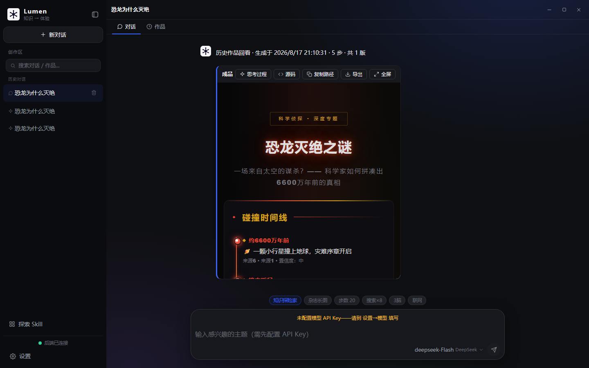
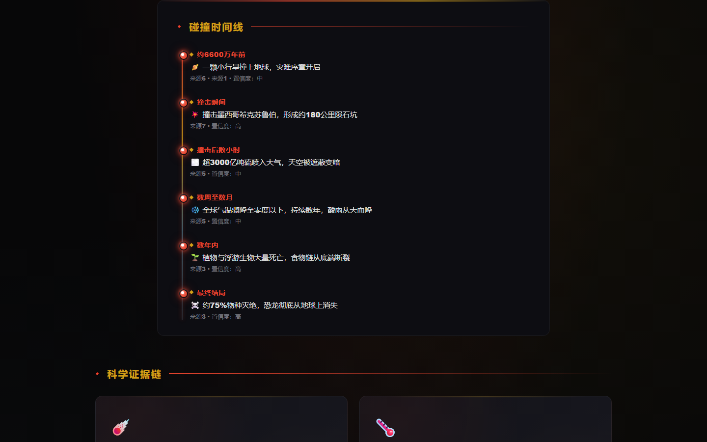
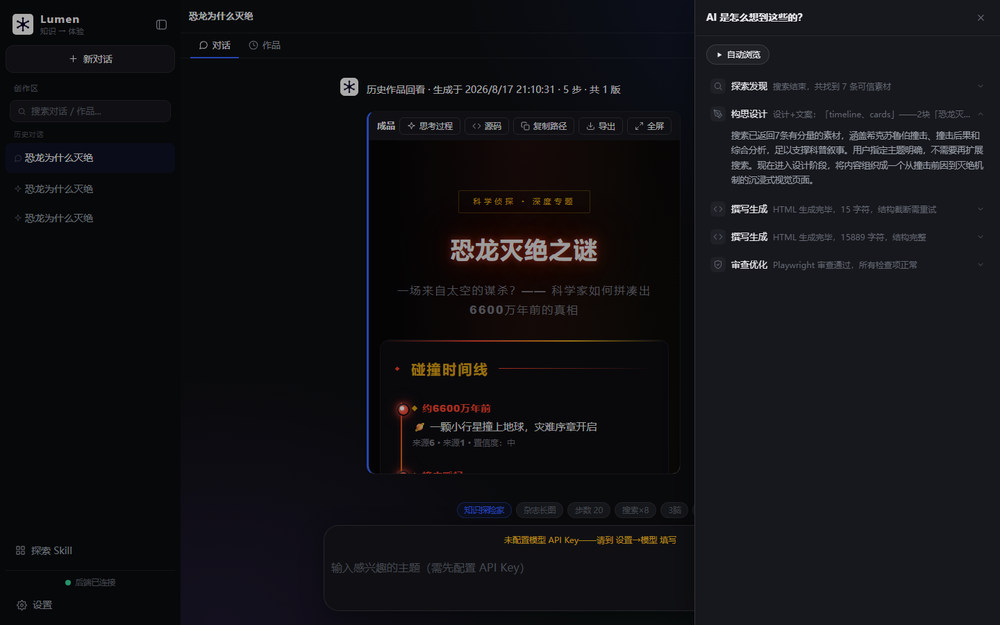
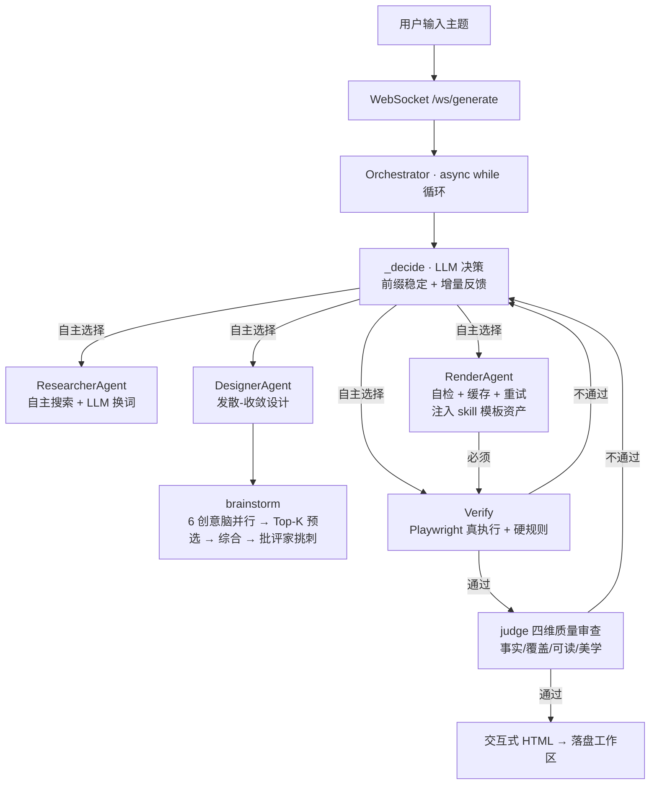

<picture>
  <source media="(prefers-color-scheme: dark)" srcset="screenshots/header-dark.svg">
  
</picture>

<div align="center">

**Lumen · AI 主题学习引擎** — 输入任意主题，LLM 自主编排多 Agent 工作流，把它变成一张结构清晰、视觉精美、读得懂的交互式知识网页。面向年轻人与儿童，把复杂概念讲清楚，让"了解一个主题"本身变得有趣。

[](LICENSE)


[](https://github.com/hfujw/ai-native-workflow/actions)

</div>

## 💡 它是什么

**三个关键词：**

1. **AI 原生编排** —— 流程不被人写死。LLM 自主决定：要不要搜、搜几次、怎么设计、审查不过退给谁。不是"调了 LLM 的流水线"，是流程由 LLM 自己决定。
2. **可插拔 Skill** —— 能力不被人写死。风格（杂志 / 信息图 / 像素）是可选的 skill，从外部下载安装；你给 LLM 装什么手艺，它就会什么手艺。
3. **思考过程全透明** —— 每一步决策、每次工具调用实时可见；历史作品可回放"AI 是怎么想到这些的"。对学习者来说，这是思维示范。

## 🖼️ 真实运行演示

输入 **"恐龙为什么灭绝"** → AI 自主搜索素材 → 设计叙事 → 渲染页面 → 审查通过：

<p align="center">
  
</p>

产物是一张有视觉层级的教育网页（杂志风格）：

<p align="center">
  
</p>

思考过程全透明——点击作品可回放"AI 是怎么想到这些的"：

<p align="center">
  
</p>

> 🧪 产物 HTML 已归档到仓库，浏览器直接打开即可零配置体验（无需启动后端）：[`examples/dinosaur-extinction.html`](examples/dinosaur-extinction.html)
>
> *真实截图由 `backend/scripts/capture_demo.py` 自动截取。*

---

## 学习场景

| 你输入 | Lumen 怎么讲 | 产出的网页 |
|--------|-------------|-----------|
| "恐龙为什么灭绝" | 先搜证据 → 用时间线 + 对比卡片呈现撞击说 vs 火山说 | 有视觉层次的知识长页 |
| "光合作用原理" | 数据型创意脑打头 → 流程 + 数据面板讲清化学反应 | 图表辅助理解 |
| "秦始皇" | 人物时间轴 + 卡片，素材考证后标注来源 | 编辑级叙事长页 |

产物不是干巴巴的文字流——是带视觉层级的交互网页。下面是一份真实产物的 HTML 骨架（杂志风格，由 LLM 按 skill 模板填充生成）：

<details>
<summary>📄 展开看产物 HTML 骨架（杂志风格）</summary>

```html
<div class="wrap">
  <div class="kicker">专题</div>              <!-- 眉题：告诉读者这是哪类内容 -->
  <h1>大标题</h1>                             <!-- 一级标题：最大字号 -->
  <p class="lede">导语：一句话钩子</p>          <!-- 导语：弱化的说明文字 -->
  <p>正文…</p>

  <div class="rule"></div>                     <!-- 分隔线：章节间的视觉停顿 -->

  <h2>章节标题</h2>                            <!-- 二级标题：左侧色条标记 -->
  <div class="tl">                             <!-- 时间线：垂直轴 + 圆点节点 -->
    <div class="tl-item">
      <div class="tl-year">年份</div>           <!-- 强调色年份 -->
      <div class="tl-text">事件</div>
    </div>
  </div>

  <div class="figure">                          <!-- 数据面板：白底卡片 + 大号数字 -->
    <div class="num">关键数字</div>
    <div class="cap">图注</div>
  </div>

  <blockquote>金句引用</blockquote>             <!-- 引用：左侧金线 + 斜体 -->
  <div class="grid2"><div>内容A</div><div>内容B</div></div>  <!-- 双栏对比 -->

  <div class="footer">来源与说明</div>          <!-- 页脚：来源标注 -->
</div>
```
</details>

> 三种风格（杂志 / 信息图 / 像素）各有独立模板，LLM 按 skill 选择注入。上面的骨架说明**为什么产物是"教育网页"而不是"文字段落"**：字号分级、色块分隔、时间线/数据面板/引用各有视觉锚点。

---

## 架构



**硬边界**（LLM 不能突破）：最多 20 步 · 搜索 ≤8 次 · render 后必须 verify · 连续 2 次 verify 失败诚实交付 · 每步思考实时流式推送。

---

## 快速开始

**前置要求**：Python 3.11+ · Node.js 18+ · 一个 LLM API Key（DeepSeek 等）

```bash
git clone https://github.com/hfujw/ai-native-workflow.git
cd ai-native-workflow

# 1. 后端
cd backend
python -m venv venv
venv\Scripts\pip install -r requirements.txt      # Windows
venv\Scripts\python -m uvicorn app.main:app --port 8001

# 2. 前端（Tauri 桌面应用，新终端）
cd desktop
npm install
npm run tauri dev
```

### 首次启动

- **不需要任何 .env / 环境变量** —— 模型信息（Key / 地址 / 模型名）全部在前端设置里填
- 打开应用 → **设置 → 模型**：给提供方填 API Key、地址、模型名（如 DeepSeek `https://api.deepseek.com` / `deepseek-v4-flash`）
- 需要联网搜索 → **设置 → 搜索服务**：给 Tavily（或自定义服务）填 Key
- 没填 Key 也能生成——生成时会明确提示"未配置模型/API Key"，绝不静默
- 生成完的页面自动落盘到 `backend/workspace/`（每版一个文件），成品栏可导出 / 复制路径
- 每个产物生成后自动跑**五维质量打分**（信息架构 / 视觉层次 / 段落长度 / 事实锚定 / 互动元素），满分 5 分——打分器是纯正则，不依赖 LLM，客观可复现（`backend/app/observability/artifact_quality.py`）
- 产物中的**外部链接（如百科、NASA）需联网访问**——离线查看时链接不可点，页面主体不受影响

---

## 项目结构

```
backend/app/
├── main.py                     🚪 FastAPI 装配（日志 + 路由）
├── config.py                   ⚙️ 集中配置
├── projects.py                 💾 生成历史持久化（含迭代版本 + 工作区文件路径）
├── workspace.py                📄 页面工作区：每版产物落盘独立 HTML 文件
├── api/
│   ├── generate.py             WS /ws/generate（主链路 + 多轮迭代）+ POST /api/generate
│   ├── history.py              历史列表 / 回看 / 重命名 / 置顶 / 删除
│   ├── skills.py               skill 列表 / 安装 / 删除
│   ├── workspace.py            删除工作区产物文件
│   ├── meta.py                 示例话题 + 评测报告
│   └── ws.py                   WebSocket 连接管理
│
├── agent/
│   ├── orchestrator.py         ⭐ async 主循环 + refine 多轮迭代
│   ├── brainstorm.py           ⭐ 发散-收敛：6 创意脑并行 + Top-K 预选 + 综合 + 批评家
│   ├── supervisor.py           工具注册表 + 分发（search 别名 research）
│   ├── message_bus.py          Agent 间消息总线（design 求助 search）
│   └── evaluate.py             素材质量评估（非 LLM 判定）
│
├── tools/                      🔧 工具（一能力一文件）
│   ├── search.py               tool_search + ResearcherAgent（LLM 换词）
│   ├── design.py               tool_design + tool_compose + DesignerAgent
│   ├── render.py               tool_render(_stream) + RenderAgent（自检 + 缓存 + 重试）
│   └── verify.py               tool_verify（Playwright 真执行）
│
├── skills/                     🎨 skill 系统（一文档制：frontmatter + 正文人格）
│   ├── __init__.py             加载 / 安装 / 删除 / 人格注入
│   └── personas.py             系统人格（core/judge/critique/refine）来源
│
├── llm/
│   ├── client.py               chat / chat_json / chat_stream + 会话级客户端（模型必须前端填）
│   ├── judge.py                ⭐ 四维质量审查 + 设计批评家
│   ├── parser.py               strip_fence + safe_parse_json + 注入检测
│   └── circuit_breaker.py      三态断路器
│
├── knowledge/kb.py             📚 169 个示例话题 + 关键词匹配
└── observability/
    ├── trace.py                📊 决策轨迹落盘（每步 thought/工具，JSONL）
    └── session_log.py          📄 会话日志：每次生成一个独立文件

backend/skills/                  🎨 运行时 skill 目录（gitignored）
backend/workspace/               📄 生成页面工作区（gitignored）
backend/tests/                   🧪 220 个 pytest 用例

desktop/src/                    🖥️ Tauri 桌面前端（DSH 设计语言）
├── App.tsx                     主布局 + 消息流 + 成品卡 + 侧边栏
├── components/                 Composer / ToolCard / SettingsButton / SkillPage / icons
└── hooks/                      useGenerate（WS）/ usePersistentState / useDropdown / useClickOutside
```

---

## 特性

- **多 Agent 自主编排**：Orchestrator 让 LLM 每一步自己决定调哪个工具，带容错、硬边界、预算护栏（步数 + 搜索次数）
- **发散-收敛设计**：创作时 6 个创意脑并行发散 → Top-K 预选 → 综合 → 批评家挑刺；执行时单脑闭环
- **Skill 是编排策略，不是皮肤**：风格 skill 会改变 AI 的组件选择（杂志优先时间线叙事、信息图优先数据面板）、文案语气（叙事感 vs 数据化）和交互基因（阅读进度条 / 数字滚动动画）——同一主题用不同 skill 产出结构迥异的页面
- **六维质量审查**：事实 / 覆盖 / 可读 / 美学 / 教育适配，审查不过退回正确的节点重做
- **流式思考透明**：决策 thought 实时流式推送，工具产出进卡片详情，全程可见
- **页面工作区**：每次生成 / 迭代落盘独立 HTML 文件（`v1`、`v2`…），成品卡可导出（下载 HTML）
- **Skill 系统**：风格 skill 可下载 / 安装 / 删除；系统人格内置不可删；一个 skill 一个 markdown
- **多轮迭代**：成品后继续对话改页面，LLM 决定 rerender / redesign / research
- **会话日志**：每次生成一个独立日志文件，好回看
- **模型 / 搜索服务可配置**：多提供方、自定义 Key / 地址 / 模型名

---

## Roadmap

- **思考回放**：历史作品的"AI 是怎么想到这些的"时间轴面板（已完成 ✅——trace 落盘 + 前端可视化，见 /api/history/{id}/trace）
- **教育游戏生成**：基于现有编排架构扩展 render 输出到 Canvas，生成交互式教育小游戏
- **断线续传**：WS 会话状态持久化 + 重连续推
- **i18n**：多语言界面

---

## 关键设计决策

| 决策 | 为什么 |
|------|--------|
| 不用 LangGraph | async while 循环最合适，工具接口 state-in/state-out，预留迁移 |
| 发散-收敛（Kimi Swarm 最小版） | 创造时多脑并行 + 综合 + 批评家，执行时单脑 |
| 验证外置 | Playwright 真执行，不是 LLM 猜对错 |
| 诚实模式 | 素材不足时降级为"资料有限"页面，不编造 |
| 搜索是可选增强 | LLM 决策中心，有把握直接跳过搜索 |
| 模型必须前端填 | 后端无默认模型，Key/地址/模型名全在前端设置，本地可控 |
| 会话日志分开 | 每次生成一个文件，日志不再堆成一座山 |
| 页面工作区 | 每版产物独立文件，可导出（下载 HTML） |
| Skill 一文档制 | 一个 skill 一个 markdown，系统人格内置不可删 |

---

## 关键词

`ai-native` `llm-orchestration` `multi-agent` `react-agent` `visual-storytelling` `education-tech` `fastapi-websocket` `playwright-verification` `tauri` `deepseek-api` `skill-system` `divergent-convergent` `honest-ai` `circuit-breaker` `streaming-thought`
