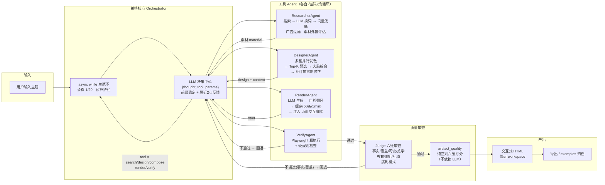

<div align="center">


<h1>Lumen</h1>

<p><strong>AI 自主编排的教育内容引擎</strong></p>

<p>输入任意主题，LLM 自主决定怎么搜、怎么设计、怎么写、怎么审，<br>
输出一张结构清晰、视觉精美的交互式知识网页。面向年轻人与儿童。</p>

<p>
  <a href="https://github.com/hfujw/lumen/actions"></a>
  
  <a href="LICENSE"></a>
</p>

</div>

---

## 从这里开始

| 你想做什么 | 去哪 |
|:---|:---|
| 快速体验产物质量（不安装） | [直接打开产物 HTML](examples/dinosaur-extinction.html) |
| 安装并跑第一个主题 | [快速开始](#快速开始) |
| 了解技术架构 | [架构](#架构) |
| 配置模型 / 搜索 / Skill | [首次使用](#首次使用) |
| 查看或扩展代码 | [项目结构](#项目结构) |

---

## 这是什么

Lumen 把**编排权交给 LLM**：流程不被人写死，每一步调哪个工具、审查不过退给谁，由 LLM 自己决定。人只负责输入主题，AI 负责当主编。

| | 常规 AI 写作 | Lumen |
|:---|:---|:---|
| **流程** | 人写死模板，AI 填空 | LLM 自主决定工具链与回退策略 |
| **设计** | 单一路径生成 | 多创意脑并行发散 → Top-K 预选 → 批评家挑刺 |
| **审查** | LLM 自评"我觉得不错" | Playwright 真执行 + 六维质量审查 |
| **风格** | 换 CSS 皮肤 | Skill 改变编排策略：组件选择、文案语气、交互基因全不同 |
| **诚实** | 素材不足时编造 | 自动降级"资料有限"页面，不编造 |

---

## 真实运行

输入**"恐龙为什么灭绝"**，AI 自主编排完整工作流：

<p align="center">
  <br>
  <sub>创作区：输入主题，AI 实时展示思考过程</sub>
</p>

产物是一张带视觉层级的教育网页（杂志风格）：

<p align="center">
  <br>
  <sub>产物预览：AI 生成的教育网页，带时间线与对比卡片</sub>
</p>

点击"思考过程"，回放 AI 每一步决策：

<p align="center">
  <br>
  <sub>思考回放：探索 → 构思 → 撰写 → 审查 → 评估</sub>
</p>

> **零配置体验**：产物 HTML 已归档 [`examples/dinosaur-extinction.html`](examples/dinosaur-extinction.html)，浏览器直接打开即可查看。

---

## 架构

LLM 是决策中心，不是流水线工人——**流程不被人写死**，每一步由 LLM 自主决定调哪个工具、要不要搜、审查不过退给谁。



### 编排核心（orchestrator）

**async while 循环，不是状态图**。LLM 每步输出 `{thought, tool, params}`，orchestrator 执行工具、把结果反馈回上下文，再让 LLM 决定下一步。关键设计：

- **决策严谨性**：`_decide` 半截 JSON 容错重试 + prompt 前缀稳定（KV 缓存友好）+ 最近 2 步工具结果结构化回填——LLM 真正"看到"上一步再决策，不是每次都重启。
- **流式思考**：LLM 边生成边把 thought 增量推给前端，决策卡片逐字"长出来"，不干等。
- **零素材防呆**：素材为 0 且没搜过时，禁止直接 design（否则空素材降级百科），强制先 search。
- **强制回退**：verify 不过 / 审查不过时，orchestrator 直接 `force_next_tool` 跳回正确节点，不让 LLM 自己纠结。
- **断路器**：连续 3 次 LLM 失败熔断 30 秒（CLOSED → OPEN → HALF_OPEN → CLOSED），防级联故障刷屏。

### 四个 Agent（各自内部有决策循环）

| Agent | 职责 | 内部机制 |
|-------|------|---------|
| **ResearcherAgent** | 素材检索 | 搜索无结果时 LLM 自动换词重搜 + 向量兜底；过滤广告/推广噪音；素材质量外置评估（规则判定，非 LLM 自评） |
| **DesignerAgent** | 设计叙事 + 写文案 | 发散-收敛：多创意脑并行产出方案 → Top-K 预选 → 大脑综合 → 批评家挑刺修正；素材不够时通过消息总线向 Researcher 求助 |
| **RenderAgent** | 生成 HTML | 自检循环（缺标签/占位符/base64 图片自动重试）+ 缓存（50 条 / 5 分钟 TTL）+ 后端自动注入 skill 交互脚本 |
| **VerifyAgent** | 审查产物 | Playwright 真执行（抓 JS 错误）+ 硬规则（HTML 完整性/来源覆盖率） |

### 质量审查（judge）

verify 通过后进入**六维质量审查**：事实 / 覆盖 / 可读 / 美学 / 教育适配 / 互动。审查是"挑刺模式"——不评分，只找具体缺陷，每条可指导修改；事实/覆盖问题才强制回退，可读/美学问题带 issues 交付。产物另有一套**纯正则六维打分器**（artifact_quality），不依赖 LLM，客观可复现。

### Skill 系统

Skill 不是皮肤，是**编排策略**：每个 skill 带 `design_priority`（组件偏好）/ `compose_tone`（文案语气）/ `interaction`（交互基因）——注入 design/compose/render 的 prompt，让同一主题用不同 skill 产出结构迥异的页面。

### 硬边界（LLM 不能突破）

- 最多 20 步 · 搜索 ≤ 8 次
- render 后必须 verify
- 连续 2 次 verify 失败 → 诚实交付
- 每步思考实时流式推送
- 预算护栏：真实 token 成本按费率表计入虚拟 ¥1/次上限

---

## 快速开始

**前置**：Python 3.11+ · Node.js 18+ · 一个 LLM API Key

**1. 克隆并启动后端**

```bash
git clone https://github.com/hfujw/lumen.git
cd lumen/backend
python -m venv venv
venv\Scripts\pip install -r requirements.txt
venv\Scripts\python -m uvicorn app.main:app --port 8001
```

**2. 启动前端（新终端）**

```bash
cd lumen/desktop
npm install
npm run tauri dev
```

### 首次使用

1. 打开应用 → **设置 → 模型**：填 API Key（如 DeepSeek）
2. **设置 → 搜索服务**：填 Tavily Key（可选，推荐）
3. 输入主题，点击发送

> 未配置 Key 时发送按钮自动禁用并提示，绝不静默失败。

---

## 项目结构

<details>
<summary><b>项目结构（点击展开）</b></summary>

```
backend/app/
├── agent/
│   ├── orchestrator.py      主循环 + refine 迭代
│   ├── brainstorm.py        多脑发散-收敛 + 批评家
│   └── evaluate.py          素材质量评估（规则判定）
├── tools/
│   ├── search.py            ResearcherAgent（LLM 换词重搜）
│   ├── design.py            DesignerAgent（素材不够自动求助）
│   ├── render.py            RenderAgent（自检 + 缓存 + 重试）
│   └── verify.py            Playwright 真执行
├── llm/
│   ├── judge.py             六维质量审查
│   └── client.py            多模型抽象层
├── skills/                  Skill 加载 / 安装 / 人格注入
└── observability/
    ├── trace.py             决策轨迹 JSONL
    └── artifact_quality.py  产物六维正则打分

desktop/src/                 Tauri 桌面前端
├── App.tsx                  全局状态 + 布局
├── components/              Composer / ToolCard / TraceTimeline
└── hooks/                   useGenerate（WS）/ usePersistentState
```

</details>

---

## 当前特性（v0.1.0）

**编排**
- AI 自主编排：LLM 每步决定工具选择，带步数/搜索次数预算护栏
- 发散-收敛设计：创作时多脑并行 + Top-K + 批评家；执行时单脑闭环
- 多轮迭代：成品后继续对话改页面，LLM 决定 rerender / redesign / research

**质量**
- 六维质量审查：事实 / 覆盖 / 可读 / 美学 / 教育适配 / 互动，审查不过退回重做
- Playwright 真执行：verify 不是 LLM 猜对错，是浏览器真跑
- 诚实模式：素材不足时自动降级，不编造数字/年份/人名

**Skill 系统**
- Skill 是编排策略：改变组件选择、文案语气、交互基因（进度条 / 数字滚动 / 翻转卡片）
- 同一主题用不同 skill 产出结构迥异的页面
- 可下载 / 安装 / 删除；系统人格内置不可删

**透明与工程**
- 思考过程全透明：决策 thought 实时流式推送，历史作品可回放完整决策链
- 页面工作区：每版产物独立 HTML 文件，可导出下载
- 产物质量自动打分：六维正则判定，不依赖 LLM
- 220+ 测试 + CI 全绿

---

## Roadmap

**v0.1.0（当前）**
- [x] AI 自主编排多 Agent 工作流
- [x] Skill 系统（杂志 / 信息图 / 像素）
- [x] 思考回放：历史作品决策时间轴
- [x] 六维质量审查 + Playwright 真执行
- [x] 产物自动评分

**未来版本**
- [ ] 教育游戏生成：基于现有编排架构扩展 Canvas 交互小游戏
- [ ] 断线续传：WS 会话状态持久化 + 重连续推
- [ ] i18n：多语言界面

---

## 关键设计决策

| 决策 | 理由 |
|:---|:---|
| 不用 LangGraph | async while 循环最合适，工具接口 state-in/state-out，预留迁移 |
| 验证外置 | Playwright 真执行，不是 LLM 猜对错 |
| 模型必须前端填 | 后端无默认模型，Key/地址/模型名全在前端设置，本地可控 |
| 搜索是可选增强 | LLM 决策中心，有把握直接跳过搜索 |
| Skill 一文档制 | 一个 skill 一个 markdown，系统人格内置不可删 |
| 会话日志分开 | 每次生成一个文件，日志不再堆成一座山 |
| 零素材防呆 | 素材为 0 时禁止直接设计——先搜索建立事实锚定，避免降级百科 |
