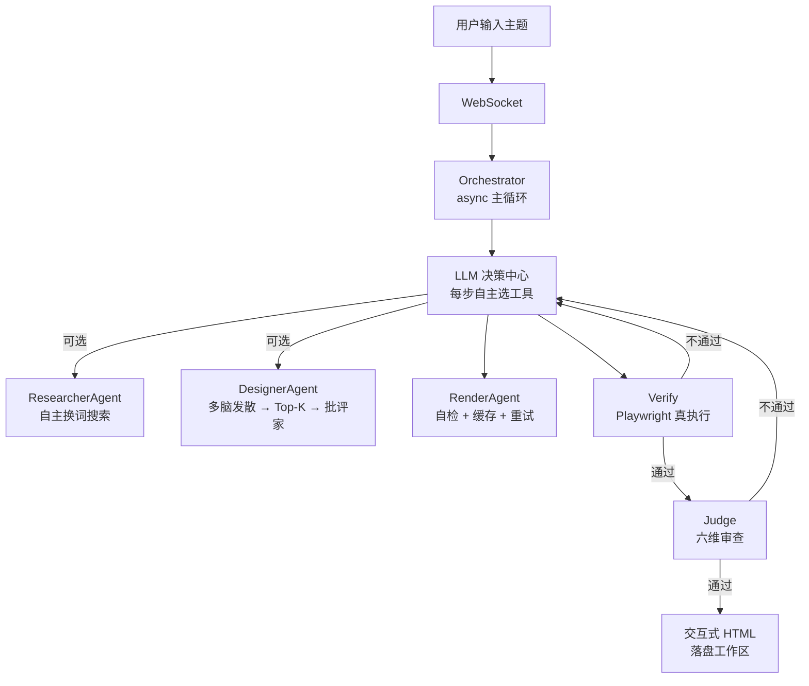

<picture>
  <source media="(prefers-color-scheme: dark)" srcset="https://raw.githubusercontent.com/hfujw/lumen/master/screenshots/header-dark.svg">
  
</picture>

<div align="center">

# Lumen

**AI 自主编排的教育内容引擎**

输入任意主题，LLM 自主决定怎么搜、怎么设计、怎么写、怎么审，<br>
输出一张结构清晰、视觉精美的交互式知识网页。面向年轻人与儿童。

[](https://github.com/hfujw/lumen/actions)

[](LICENSE)

</div>

---

## 🎯 它不是什么

不是 "AI 写网页工具"，不是 "换皮 ChatGPT"。

Lumen 的核心差异在于 **编排权交给 LLM**：流程不被人写死，每一步调哪个工具、审查不过退给谁，由 LLM 自己决定。人只负责输入主题，AI 负责当主编。

| | 常规 AI 写作 | Lumen |
|---|---|---|
| **流程** | 人写死模板，AI 填空 | LLM 自主决定工具链与回退策略 |
| **设计** | 单一路径生成 | 多创意脑并行发散 → Top-K 预选 → 批评家挑刺 |
| **审查** | LLM 自评 "我觉得不错" | Playwright 真执行 + 六维质量审查 |
| **风格** | 换 CSS 皮肤 | Skill 改变编排策略：组件选择、文案语气、交互基因全不同 |
| **诚实** | 素材不足时编造 | 自动降级 "资料有限" 页面，不编造 |

---

## 🖼️ 真实运行

输入 **"恐龙为什么灭绝"**，AI 自主编排完整工作流：

<p align="center">
  <br>
  <sub>创作区：输入主题，AI 实时展示思考过程</sub>
</p>

产物是一张带视觉层级的教育网页（杂志风格）：

<p align="center">
  <br>
  <sub>产物预览：AI 生成的教育网页，带时间线与对比卡片</sub>
</p>

点击"思考过程"，回放 AI 每一步决策：

<p align="center">
  <br>
  <sub>思考回放：🔍 探索 → 🎨 构思 → 📝 撰写 → ✅ 审查 → 🧐 评估</sub>
</p>

> 📄 **零配置体验**：产物 HTML 已归档 [`examples/dinosaur-extinction.html`](examples/dinosaur-extinction.html)，浏览器直接打开即可查看。

---

## 🏗️ 架构

LLM 是决策中心，不是流水线工人：



**硬边界**：最多 20 步 · 搜索 ≤8 次 · render 后必须 verify · 连续 2 次 verify 失败诚实交付 · 每步思考实时流式推送。

---

## 🚀 快速开始

**前置**：Python 3.11+ · Node.js 18+ · 一个 LLM API Key

```bash
git clone https://github.com/hfujw/lumen.git
cd lumen

# 终端 1：后端
cd backend && python -m venv venv
venv\Scripts\pip install -r requirements.txt
venv\Scripts\python -m uvicorn app.main:app --port 8001

# 终端 2：前端
cd desktop && npm install && npm run tauri dev
```

**首次使用**：
1. 打开应用 → **设置 → 模型**：填 API Key（如 DeepSeek）
2. **设置 → 搜索服务**：填 Tavily Key（可选，推荐）
3. 输入主题，点击发送

> 未配置 Key 时发送按钮自动禁用并提示，绝不静默失败。

---

## 📂 项目结构

<details>
<summary>点击展开</summary>

```
backend/app/
├── agent/
│   ├── orchestrator.py      ⭐ 主循环 + refine 迭代
│   ├── brainstorm.py        ⭐ 多脑发散-收敛 + 批评家
│   └── evaluate.py          素材质量评估（规则判定）
├── tools/
│   ├── search.py            ResearcherAgent（LLM 换词重搜）
│   ├── design.py            DesignerAgent（素材不够自动求助）
│   ├── render.py            RenderAgent（自检 + 缓存 + 重试）
│   └── verify.py            Playwright 真执行
├── llm/
│   ├── judge.py             ⭐ 六维质量审查
│   └── client.py            模型抽象层
├── skills/                  Skill 加载 / 安装 / 人格注入
└── observability/
    ├── trace.py             决策轨迹 JSONL
    └── artifact_quality.py  产物六维正则打分

desktop/src/                 Tauri 桌面前端
├── App.tsx                  全局状态 + 布局
├── components/              Composer / ToolCard / TraceTimeline
└── hooks/                   useGenerate（WS）/ usePersistentState
```

</details>

---

## ✨ 特性

**编排**
- AI 自主编排：LLM 每步决定工具选择，带步数/搜索次数预算护栏
- 发散-收敛设计：创作时多脑并行 + Top-K + 批评家；执行时单脑闭环
- 多轮迭代：成品后继续对话改页面，LLM 决定 rerender / redesign / research

**质量**
- 六维质量审查：事实 / 覆盖 / 可读 / 美学 / 教育适配 / 互动，审查不过退回重做
- Playwright 真执行：verify 不是 LLM 猜对错，是浏览器真跑
- 诚实模式：素材不足时自动降级，不编造数字/年份/人名

**Skill 系统**
- Skill 是编排策略：改变组件选择、文案语气、交互基因（进度条 / 数字滚动 / 翻转卡片）
- 同一主题用不同 skill 产出结构迥异的页面
- 可下载 / 安装 / 删除；系统人格内置不可删

**透明与工程**
- 思考过程全透明：决策 thought 实时流式推送，历史作品可回放完整决策链
- 页面工作区：每版产物独立 HTML 文件，可导出下载
- 产物质量自动打分：六维正则判定（信息架构/视觉/段落/事实锚定/互动/教育适配）

---

## 🗺️ Roadmap

- [x] 思考回放：历史作品决策时间轴
- [ ] 教育游戏生成：基于现有编排架构扩展 Canvas 交互小游戏
- [ ] 断线续传：WS 会话状态持久化 + 重连续推
- [ ] i18n：多语言界面

---

## 📐 关键设计决策

| 决策 | 理由 |
|---|---|
| 不用 LangGraph | async while 循环最合适，工具接口 state-in/state-out，预留迁移 |
| 验证外置 | Playwright 真执行，不是 LLM 猜对错 |
| 模型必须前端填 | 后端无默认模型，Key/地址/模型名全在前端设置，本地可控 |
| 搜索是可选增强 | LLM 决策中心，有把握直接跳过搜索 |
| Skill 一文档制 | 一个 skill 一个 markdown，系统人格内置不可删 |
| 会话日志分开 | 每次生成一个文件，日志不再堆成一座山 |
| 零素材防呆 | 素材为 0 时禁止直接设计——先搜索建立事实锚定，避免降级百科 |
