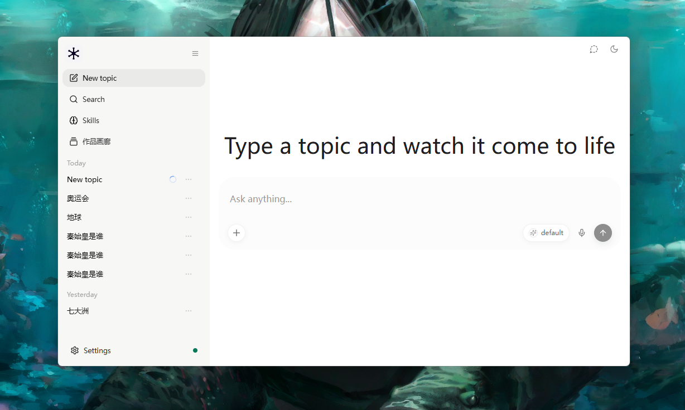

<div align="center">


# Lumen

<p><strong>给 LLM 装可插拔 skill 的 AI 原生工作台</strong></p>

<p>你选 skill（风格 + 工具）、定模式，LLM 自己决定怎么搜、怎么设计、怎么写、怎么审，<br>
输出一张结构清晰、视觉精美的交互式知识网页。全程透明、可迭代。</p>

<p>
  
  
  
  
</p>

</div>

---

## 从这里开始

| 你想做什么 | 去哪 |
|:---|:---|
| 快速体验产物质量（不安装） | [直接打开产物 HTML](examples/dinosaur-extinction.html) |
| 安装并跑第一个主题 | [快速开始](#-快速开始) |
| 了解它能做什么 | [它能做什么](#-它能做什么) |
| 配置模型 / 搜索 / Skill | [首次使用](#首次使用) |
| 查看或扩展代码 | [项目结构](#-项目结构) |

---

## 它能做什么

Lumen 是给 LLM 装可插拔 skill 的 AI 原生工作台。它可以：

- 输入任意主题，LLM **自主编排**搜索 → 设计 → 渲染 → 审查 → 迭代的完整工作流
- 用可插拔 **skill**（像素 / 杂志 / 信息图）改变编排策略——组件选择、文案语气、交互基因全不同
- 用 **Playwright 真执行**验证产物，不是 LLM 猜对错
- 四维质量审查（事实 / 覆盖 / 可读 / 美学），素材不足时**诚实交付**不编造
- 通过 OpenAI 兼容网关（`/v1/responses` SSE）流式输出——思考过程实时推送
- 自带 WebUI（**浏览器 + Tauri 桌面端**）：**思考流全程透明**（思考块 + 工具卡）、**成品全屏预览**、**作品画廊**回看 / 继续迭代
- 所有决策落盘 DecisionLog（JSONL），随时回放"AI 是怎么想到这些的"

## 💡 为什么是 Lumen

- **编排权交给 LLM**：流程不被人写死，每一步调哪个工具、审查不过退给谁，LLM 自己决定
- **思考全透明**：决策 thought 实时流式推送，历史作品可回放完整决策链——不是黑箱
- **能力可插拔**：Skill = 编排策略，给 LLM 装什么手艺，它就有什么手艺
- **验证是真执行**：Playwright 无头浏览器真跑，不是 LLM 自评"我觉得不错"
- **诚实是底线**：素材不足自动降级"资料有限"页面，不编造数字/年份/人名
- **浏览器 + 桌面端**：同一套 WebUI，既能浏览器（5173）打开，也能打包成 Tauri 桌面应用

---

## WebUI

**创作区：输入主题，AI 实时展示思考过程**

<p align="center">
  <br>
  <sub>创作区：输入主题，AI 实时展示思考过程</sub>
</p>

---

## 🚀 快速开始

**前置**：Python 3.13 · Node.js 18+ · 一个 DeepSeek API Key（可选 Tavily 搜索 Key）

**1. 克隆并启动后端**

```bash
git clone git@github.com:hfujw/lumen.git
cd lumen/backend
python -m venv venv
venv\Scripts\pip install -r requirements.txt
venv\Scripts\python -m uvicorn app.main:app --port 8001
```

**2. 启动 WebUI 前端（新终端）**

```bash
cd lumen/webui
npm install
npm run dev   # http://127.0.0.1:5173
```

**（可选）桌面端（Tauri）**

```bash
cd lumen
npm install          # 根目录，装 tauri CLI
npm run tauri:dev    # 开发模式：桌面窗口加载 webui
# 或打包
npm run tauri:build  # 产物：src-tauri/target/release/lumen.exe
```

> 桌面端需要后端在 8001 运行（见步骤 1）。桌面端 API 请求自动指向 `http://127.0.0.1:8001`。

### 首次使用

1. 打开应用 → **设置 → 模型**：填 DeepSeek API Key
2. **网页搜索服务**：选 Tavily / 自定义，填搜索 Key（可选，推荐——不填则只搜本地知识库，素材较少）
3. 输入主题，点击发送

> 前端填的 Key 存本地浏览器（localStorage），生成请求自动携带——**Key 不进后端配置**。

---

## 🏗️ 架构

LLM 是决策中心，不是流水线工人——**流程不被人写死**，每一步由 LLM 自主决定。

> 🖼️ **架构图占位**（作者自绘中，待补充）——文字版架构见下方。

### 编排核心（orchestrator）

**async while 循环，不是状态图**。LLM 每步输出 `{thought, tool, params}`，orchestrator 执行工具、把结果反馈回上下文，再让 LLM 决定下一步。关键设计：

- **决策严谨性**：半截 JSON 容错重试 + prompt 前缀稳定（KV 缓存友好）+ 最近 2 步工具结果结构化回填
- **流式思考**：thought 增量实时推给前端，决策卡片逐字"长出来"
- **零素材防呆**：素材为 0 且没搜过时，禁止直接 design，强制先 search
- **强制回退**：verify / 审查不过时，orchestrator 直接跳回正确节点
- **断路器**：连续 3 次 LLM 失败熔断 30 秒，防级联故障

### 四个 Agent（各自内部有决策循环）

| Agent | 职责 | 内部机制 |
|-------|------|---------|
| **ResearcherAgent** | 素材检索 | 搜索无结果时 LLM 自动换词重搜 + 向量兜底；过滤广告噪音；素材质量外置评估 |
| **DesignerAgent** | 设计叙事 + 写文案 | 发散-收敛：多创意脑并行 → 大脑综合 → 批评家挑刺修正 |
| **RenderAgent** | 生成 HTML | 自检循环 + 缓存 + 自动注入 skill 交互脚本 |
| **VerifyAgent** | 审查产物 | Playwright 真执行（抓 JS 错误）+ 硬规则（HTML 完整性/来源覆盖率） |

### 质量审查（四维对抗 judge）

verify 通过后进入**四维质量审查**：事实 / 覆盖 / 可读 / 美学（另有教育适配维度）。审查是"挑刺模式"——只找具体缺陷，每条可指导修改；**只有事实/覆盖的严重问题才强制回退**，可读/美学问题带 issues 诚实交付。

### OpenAI 兼容网关（/v1/responses）

深度编排**服务端自治**，对外暴露 OpenAI 兼容的流式网关（`/v1/responses` SSE）——自研 WebUI 通过结构化事件展示思考块 + 工具卡片；同一套闭环以浏览器网页和 Tauri 桌面端两种形态运行。

### Skill 系统

Skill 不是皮肤，是**编排策略**：每个 skill 带设计偏好 / 文案语气 / 交互基因——注入 design/compose/render 的 prompt，让同一主题用不同 skill 产出结构迥异的页面。

### 硬边界（LLM 不能突破）

- 最多 20 步 · 搜索 ≤ 8 次
- render 后必须 verify；verify 不过强制回退
- 质量审查不通过 → 诚实交付当前版本，不硬编造
- 每步思考实时流式推送
- 预算护栏：真实 token 成本按费率表计入虚拟 ¥1/次上限

---

## 📂 项目结构

<details>
<summary><b>项目结构（点击展开）</b></summary>

```
backend/app/
├── agent/
│   ├── orchestrator.py      主循环 + refine 迭代
│   ├── brainstorm.py        多脑发散-收敛 + 批评家
│   └── evaluate.py          素材质量评估（规则判定）
├── tools/
│   ├── search.py            ResearcherAgent（LLM 换词重搜）
│   ├── design.py            DesignerAgent（素材不够自动求助）
│   ├── render.py            RenderAgent（自检 + 缓存 + 重试）
│   └── verify.py            Playwright 真执行
├── api/
│   ├── compat.py            OpenAI 兼容网关（/v1/responses SSE，双前端接入）
│   ├── webui.py             WebUI 引导 + 成品查看
│   └── history.py           生成历史（作品画廊数据源）
├── llm/
│   ├── judge.py             四维质量审查
│   └── client.py            会话级 Key 绑定 + 模型归一化
├── skills/                  Skill 加载 / 安装 / 人格注入
└── observability/
    ├── trace.py             决策轨迹 JSONL（DecisionLog）
    └── eval_report.py       评测报告

webui/                       WebUI 前端（React + Vite）
├── src/hooks/useLumenStream.ts    /v1/responses SSE + 思考块/工具卡
├── src/lib/lumen-client.ts          深度后端客户端（LumenClient）
├── src/components/ArtifactCard.tsx  成品 iframe 预览
└── src/components/GalleryView.tsx   作品画廊
```

</details>

---

## 当前特性

**编排**
- AI 自主编排：LLM 每步决定工具选择，带步数/搜索次数预算护栏
- 发散-收敛设计：创作时多脑并行 + 批评家；执行时单脑闭环
- 多轮迭代：成品后继续对话改页面，LLM 决定 rerender / redesign / research

**质量**
- 四维质量审查：事实 / 覆盖 / 可读 / 美学，审查不过退回重做
- Playwright 真执行：verify 不是 LLM 猜对错，是浏览器真跑
- 诚实模式：素材不足时自动降级，不编造数字/年份/人名

**透明与产品**
- 思考过程全透明：结构化 SSE → 思考块 + 工具卡，可展开看完整思考
- 成品 HTML 预览：应用内 iframe 直接看成品
- 作品画廊：所有生成作品卡片化，点击回看 / 继续迭代
- 浏览器 + 桌面端：WebUI 同时以网页（Vite）和 Tauri 桌面应用形态运行

**Skill 系统**
- Skill 是编排策略：改变组件选择、文案语气、交互基因
- 同一主题用不同 skill 产出结构迥异的页面
- 可下载 / 安装 / 删除；系统人格内置不可删

**工程**
- 后端 226 测试全绿 · 前端 587 测试全绿 · tsc 0 错误 · CI 双工作流
- DecisionLog 全透明：每次生成的决策轨迹落盘 JSONL，可回放

---

## 关键设计决策

| 决策 | 理由 |
|:---|:---|
| 不用 LangGraph | async while 循环最合适，工具接口 state-in/state-out，预留迁移 |
| 验证外置 | Playwright 真执行，不是 LLM 猜对错 |
| Key 必须前端填 | 后端无默认 Key，随会话传入，本地可控、不落盘 |
| 搜索是可选增强 | 前端填搜索服务 key 才联网；不填走本地知识库 |
| 服务端自治 | 编排在服务端，对外 OpenAI 兼容网关——任意 OpenAI 兼容前端都能接入 |
| 诚实模式 | 素材不足 → "资料有限"页面，不编造 |
| 会话日志分开 | 每次生成一个文件，日志不再堆成一座山 |

---

## 🤝 贡献

欢迎提交 issue 和 PR。代码风格：后端 `ruff`，前端 `eslint`。

## 开源协议

[MIT](LICENSE)
