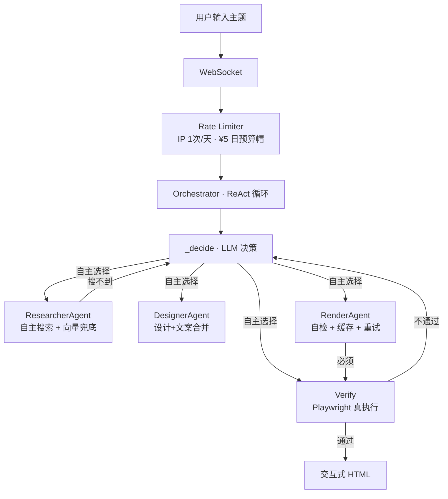

# AI-Native Workflow · 时光像素

> 输入任意主题 → LLM 自主决策每一步 → 生成交互式 HTML 页面
> 不是"调了 LLM 的流水线"，是 **LLM 自己决定流程** 的 AI 原生系统

[](LICENSE)


---

## 为什么是 AI-Native？

流程不是人写死的。LLM 自己决定：搜几次？跳过搜索直接用自身知识？审查不过退给谁？

| 传统 Pipeline | 本系统 |
|-------------|--------|
| 人决定"先搜→再设计→再写→再审查" | LLM 自主决策每一步调什么工具 |
| 审查不通过→固定退回上一步 | LLM 诊断病因→退回正确的节点 |
| 素材不足→硬着头皮生成→失败 | LLM 主动触发"诚实模式"降级 |
| 搜索死循环→耗尽预算 | 搜索 8 次硬拦截 + LLM 自身知识兜底 |
| 生成的代码对不对→LLM 自己猜 | Playwright 无头浏览器真执行验证 |

---

## 架构



**硬边界**（LLM 不能突破）：最多 20 步 · 预算 ¥1 · 搜索 ≤8 次 · render 后必须 verify · 连续 2 次 verify 失败强制终止。

---

## 演示

> TODO：加两张图——① 生成页面的效果截图（液态玻璃 UI）② DecisionLog 思考轨迹动图。
> 这是视觉产品，图比文字有说服力。放 `docs/screenshot.png` 后用 Markdown 引用即可。

---

## 端到端评测（真实数字）

`cd backend && python scripts/eval_run.py` 跑出来的真实结果（DeepSeek 真实调用）：

| 指标 | 值 |
|------|-----|
| 通过率 | **100%**（10 个不同话题，全部一次通过）|
| 平均步数 | **4.7 步** |
| 每任务真实成本 | **约 ¥0.02**（DeepSeek v4-flash 真实费率，含缓存拆分）|
| 验证方式 | 端到端评测 + Playwright 外部验证 + 决策轨迹可回放 |

> 每个任务的决策轨迹（thought/工具/成本）都落盘可回放——`backend/logs/traces/`。

---

## 快速开始

### 方式一：Docker（推荐——不需要装 Python/Node，一行命令）

```bash
git clone https://github.com/hfujw/ai-native-workflow.git
cd ai-native-workflow

# 配 Key（只需要做一次）
cp backend/.env.example backend/.env
# 编辑 backend/.env：DEEPSEEK_API_KEY=sk-xxxxxxxx

# 启动
docker-compose up
```

浏览器打开 `http://localhost:8000`。Docker 自带 Python、Playwright 浏览器、Caddy 反代——你不需要装任何东西。

### 方式二：手动启动（开发/改代码时用）

**前置要求**：Python 3.11+ · Node.js 18+ · DeepSeek API Key · Tavily Key（可选）

```bash
git clone https://github.com/hfujw/ai-native-workflow.git
cd ai-native-workflow

# 1. 配 Key
cp backend/.env.example backend/.env
# 编辑 backend/.env：DEEPSEEK_API_KEY=sk-xxxxxxxx

# 2. 后端
cd backend
python -m venv venv
venv\Scripts\pip install -r requirements.txt      # Windows
# python3 -m venv venv && source venv/bin/pip install -r requirements.txt  # macOS/Linux
venv\Scripts\python -m uvicorn app.main:app --port 8001

# 3. 前端（新终端）
cd frontend
npm install
npm run dev
```

浏览器打开 `http://localhost:5173`。

### 首次启动说明

- ChromaDB 中文模型（~400MB）首次自动从 `hf-mirror.com` 下载，国内镜像不需代理
- 下载失败不影响使用——语义检索不可用，关键词 + LLM 自身知识仍然工作
- Tavily Key 不配也没关系——搜索返回空，LLM 用自己的知识

---

## 项目结构

```
backend/app/
├── main.py                     🚪 FastAPI + WebSocket 入口
├── demo.py                     📦 Demo 页面管理
│
├── core/                       🧱 基础设施
│   ├── config.py               集中配置（pydantic-settings）
│   ├── metrics.py              9 个 Prometheus 指标
│   ├── trace.py                决策轨迹落盘（JSONL，可回放/评测）
│   ├── projects.py             生成历史持久化
│   ├── preferences.py          用户偏好记忆
│   └── eval_report.py          评测报告生成
│
├── llm/                        🤖 LLM 层
│   ├── client.py               chat / chat_json / chat_stream
│   ├── parser.py               strip_fence + clean_thought
│   └── circuit_breaker.py      三态断路器
│
├── network/                    🌐 网络层
│   ├── ws_manager.py           WebSocket 连接管理
│   └── rate_limiter.py         IP 限流 + 日预算帽
│
├── tools/                      🔧 工具实现
│   ├── search.py               Tavily + 广告过滤 + 相关性检查
│   ├── design.py               选叙事形式（7 种组件）
│   ├── compose.py              写文案 + 来源标注
│   ├── render.py               HTML 流式生成
│   └── verify.py               Playwright 真执行
│
├── agents/                     🧠 编排 + 3 Agent
│   ├── orchestrator.py         ⭐ ReAct 主循环 + refine 多轮迭代
│   ├── researcher_agent.py    Phase 3：自主搜索（换词+向量+停止）
│   ├── designer_agent.py      Phase 2：设计+文案合并（自循环）
│   ├── render_agent.py         Phase 1：自检 + 缓存 + 重试
│   ├── supervisor.py           Phase 4：消息总线编排器
│   ├── message_bus.py          Phase 4：asyncio.Queue 消息总线
│   └── evaluate.py             素材评估（非 LLM 判定）
│
├── knowledge/                  📚 知识库
│   ├── kb.py                   169 个示例话题 + 关键词匹配
│   └── vector_store.py         ChromaDB 语义向量检索
│
└── state/                      💾 存储抽象（memory / redis 一行切换）
    ├── base.py                 StateBackend ABC
    ├── memory.py               MemoryBackend（单机）
    └── redis.py                RedisBackend（多实例共享，STATE_BACKEND=redis）

backend/demos/                  预生成 HTML
backend/scripts/eval_run.py     📊 端到端评测脚本（跑 N 话题出数字）
backend/tests/                  94 个 pytest 用例

frontend/src/
├── App.jsx                     主布局（液态玻璃 + 光标聚光灯 + Sidebar 导航）
├── components/
│   ├── Sidebar.jsx             导航：生成 / 历史 / 偏好 / 评测
│   ├── DecisionLog.tsx         AI 思考流程（步骤进度线 + 实时滚动）
│   ├── StoryPanel.tsx          生成页面展示（显影动画 + 流式渲染）
│   ├── SearchBubble.tsx        搜索输入框
│   ├── EventTags.tsx           169 个示例话题标签云
│   ├── RevealLayer.tsx         光标聚光灯 Canvas mask
│   ├── FailureNotice.tsx       失败提示 + demo 引导
│   ├── ErrorBoundary.tsx       React 错误边界
│   ├── IterationBar.tsx        多轮迭代指令条（"再大胆点/换个配色"）
│   ├── HistoryPanel.tsx        生成历史（卡片列表 + 回看）
│   ├── PreferencesPanel.tsx    用户偏好（可编辑）
│   └── EvalPanel.tsx           评测数字（通过率/步数/成本）
└── hooks/
    └── useWebSocket.js         WebSocket + 多轮迭代 + 历史/偏好/评测 API

Caddyfile                       生产反代（自动 HTTPS + WebSocket + Gzip）
docker-compose.yml              一键部署
```

---

## 关键设计决策

| 决策 | 为什么 |
|------|--------|
| 不用 LangGraph | 当前规模用 async while 循环最合适。tool 接口已标准化为 state-in/state-out，预留了 LangGraph 迁移能力 |
| 3 Agent 架构 | ResearcherAgent（搜索自主决策）+ DesignerAgent（设计+文案合并）+ RenderAgent（自检+缓存）。每个有内部决策循环 |
| RenderAgent 内部自检 | render 是 token 消耗最大的一步（16384 tokens，¥0.15/次）——Agent 内部自检循环减少 verify→回退→重 render 的浪费 |
| 验证层外置 | Playwright 真执行，不是 LLM 猜对错。正则硬规则 + 浏览器执行 + 事实核查三阶段 |
| 诚实模式 | 素材不足时 LLM 主动降级为"资料有限"的诚实页面，不编造事实 |
| 搜索是可选增强 | LLM 决策中心——有把握的话题直接跳过搜索，不确定才搜。搜索不到 LLM 用自身知识兜底 |
| 向量语义检索 | ChromaDB + text2vec-base-chinese——"嬴政"能搜到"秦始皇"，关键词做不到的 |
| Tavily 替代 Bing | 国内可直连，返回 JSON 已清洗文本。不配 Key 也能跑 |
| 流式渲染 | `contentDocument.write` 写 DOM，不换 `srcdoc`——不频闪，用户看到页面逐段"长出来" |
| 断路器 | 连续 3 次 LLM API 失败自动熔断 30s，防止级联故障浪费重试和 Token |
| 预算控制 | 真实 LLM token 成本计入 ¥1 上限（DeepSeek v4-flash 费率：缓存命中 ¥0.02/M、未命中 ¥1/M、输出 ¥2/M）。IP 1 次/天试用 + 全站 ¥5/天 |
| 知识来源标注 | compose 阶段要求 LLM 给每个数字/年份/人名标注来源和可信度 |
| 结构化输出 | design/compose 用 DeepSeek `json_object` + schema 校验——坏数据不再流向下游 |
| 多轮迭代 | 成品后能继续对话改页面——LLM 决定 rerender/redesign/research，trace 记录每版 |
| 记忆与历史 | 偏好自动提取并注入下次生成；每次生成（含迭代）落盘可回看、可续 |
| 决策轨迹 | 每步 thought/工具/成本写 JSONL——可回放、可评测（面试演示素材） |
| 评测基准 | `scripts/eval_run.py` 跑 N 话题，输出通过率/步数/成本——有真实数字 |
| REST API | `POST /api/generate` 程序化生成——是"系统"不是 demo |

---

## 配置项

| 环境变量 | 默认值 | 说明 |
|---------|--------|------|
| `DEEPSEEK_API_KEY` | **必填** | DeepSeek API Key |
| `TAVILY_API_KEY` | 空（不配也能跑） | Tavily Search API Key |
| `MAX_STEPS` | 20 | Agent 最大循环步数 |
| `BUDGET_TOTAL` | 1.0 | 单次生成预算上限（元） |
| `SEARCH_MAX` | 8 | 最多搜索次数 |
| `DAILY_BUDGET` | 5.0 | 全站日预算（元） |
| `TRIALS_PER_IP` | 1 | 每 IP 每天试用次数 |
| `MAX_CONNECTIONS` | 20 | WebSocket 最大连接数 |
| `MAX_CONNECTIONS_PER_IP` | 3 | 单 IP 最大连接数 |
| `INPUT_MAX_LENGTH` | 500 | 用户输入最大长度（字符） |
| `GENERATION_TIMEOUT` | 300 | 单次生成超时（秒） |
| `LOG_RETENTION_DAYS` | 30 | 日志保留天数 |
| `LOG_PROMPTS` | 0 | 设为 1 记录完整 prompt（调试用） |
| `STATE_BACKEND` | memory | memory / redis（RedisBackend 已实现） |
| `TRUST_PROXY` | false | 是否信任反向代理的 XFF 头（docker-compose + Caddy 部署时设 true） |

---

## 关键词

`ai-native` `ai-workflow` `llm-orchestration` `react-agent` `visual-storytelling` `ai-agent` `langchain-alternative` `playwright-verification` `deepseek-api` `fastapi-websocket` `chromadb` `prometheus` `tavily` `honest-ai` `circuit-breaker` `agent-architecture` `render-agent` `multi-agent` `self-check` `vector-search`
